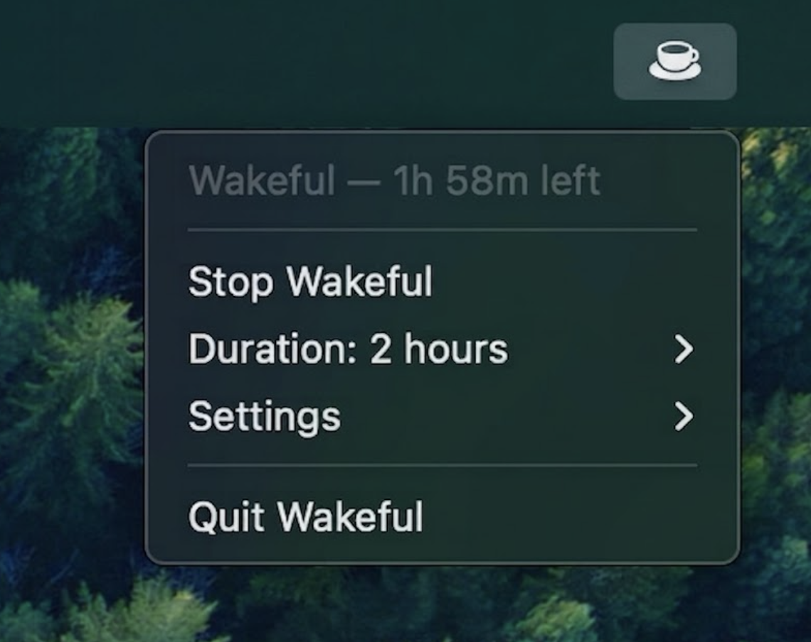

# Wakeful

**Keep your Mac awake from the menu bar**

Wakeful is a lightweight macOS utility that prevents your Mac from sleeping — with optional timers, display control, and zero Dock clutter. It wraps Apple's built-in [`caffeinate`](https://ss64.com/osx/caffeinate.html) command so you get reliable system behavior without reinventing the wheel.

<p align="center">
  
</p>

<p align="center">
  <a href="https://github.com/alphapseudo/wakeful/releases/latest"></a>
  
  
  
</p>

---

## Download

**[Get the latest release →](https://github.com/alphapseudo/wakeful/releases/latest)**

1. Download and unzip `Wakeful-x.x.x.zip`
2. Drag **Wakeful.app** into **Applications**
3. Open Wakeful — look for the coffee cup in your menu bar

> On first launch, macOS may warn that Wakeful is from an unidentified developer.  
> **Right-click → Open** to confirm, or sign and notarize the app before publishing releases.

---

## Features at a glance

Long builds, downloads, presentations, and screen shares all need the same thing: a Mac that stays awake without fiddling with System Settings. Wakeful lives in the menu bar, starts in one click, and stays out of your way.

| | |
|---|---|
| **One-click toggle** | Start or stop with a single menu action |
| **Timed sessions** | Presets from 15 minutes to 4 hours, or run until you stop |
| **Custom duration** | Pick exact hours and minutes |
| **Display control** | Optionally keep the screen on, not just the system |
| **No dependencies** | Native SwiftUI app, no runtime to install |

---

## Usage

Click the coffee cup in the menu bar:

- **Start Wakeful** — prevents idle sleep for the selected duration
- **Duration** — choose a preset or open **Custom...** for a specific length
- **Settings → Keep display awake** — also prevents the display from sleeping
- **Stop Wakeful** — ends the session immediately

When active, the icon fills in and the menu shows a live countdown.

---

## Requirements

| | |
|---|---|
| **To run** | macOS 13.0 (Ventura) or later |
| **To build** | Xcode 15+ (full Xcode, not Command Line Tools only) |

---

## Build from source

```bash
git clone https://github.com/alphapseudo/wakeful.git
cd wakeful
open Wakeful.xcodeproj
```

In Xcode, select the **Wakeful** scheme and press **⌘R**. The app appears in the menu bar.

### Release build

1. Set the scheme to **Release** (Product → Scheme → Edit Scheme)
2. **Product → Archive**
3. Export the app and zip it for [GitHub Releases](https://github.com/alphapseudo/wakeful/releases/new)

---

## How it works

Wakeful spawns `/usr/bin/caffeinate` as a child process and manages its lifecycle:

| Setting | `caffeinate` flags |
|---------|-------------------|
| Default | `-i` — prevent idle sleep |
| Keep display awake | `-i -d` |
| Timed session | `-t <seconds>` |
| Until stopped | no `-t`; runs until you stop or quit |

Your duration and display preferences are saved in `UserDefaults` and restored on relaunch.

---

## License

[MIT](LICENSE)
